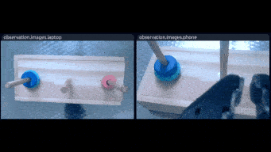

# 项目概述

本项目旨在实现一个完全本地的训练环境，避免与Hugging Face的交互，从而节省成本和时间。同时，还针对汉诺塔任务进行了专门的优化和训练。

## 功能特性

### lerobot 相关

1. **完全本地训练**：无需与Hugging Face交互，避免了因网络问题导致的训练中断和额外费用。具体修改细节请参阅：[离线训练更改细节.md](<notes/01. 离线训练更改细节.md>)
2. **数据集微操**： 删除特定episode， 数据集合并，重新计算相关统计量，具体操作步骤请参阅：[数据集微操.md](<notes/06. 数据集微操.md>) 
3. **docker部署**：实测cpu、gpu版本环境部署，可更换项目（更改 git clone 地址用最新版本的代码）具体操作步骤请参阅：[Dockerfile 安装历程](<notes/04. Dockerfile 安装历程.md>)

**注意**：官方Lerobot代码目前正在进行大规模重构，本项目仅针对汉诺塔任务进行优化，不实时跟进最新版本的代码修改。

### 汉诺塔任务相关

1. **分解动作训练**：针对汉诺塔任务每次移动训练一个模型。
2. **汉诺塔算法**：递归算法，生成模型动作序列
3. **接入大模型**：gpt分析初始状态图片，数字化初始状态，输入汉诺塔算法进行求解
4. **持续更新**：更多功能和优化正在开发中，敬请期待。

# 简单动作训练

**初始状态：**

**目标状态：**

## 动作分解：7步

### 1. Move smallest disk from A to C 

------

### 2. Move middle disk from A to B 

------

### 3. Move smallest disk from C to B 

------

### 4. Move biggest disk from A to C

------

### 5. Move smallest disk from B to A

------

### 6. Move middle disk from B to C

------

### 7. Move smallest disk from A to C

## 按序执行

[Watch the video](notes/assets/All_step_top.mp4)
