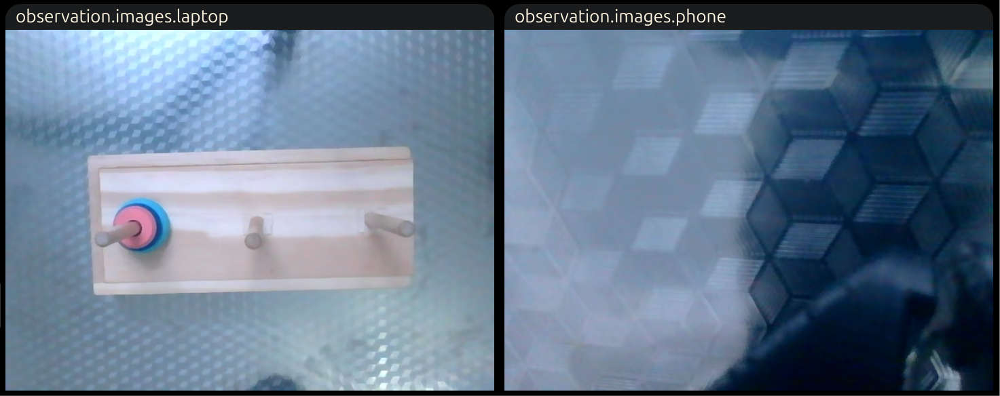
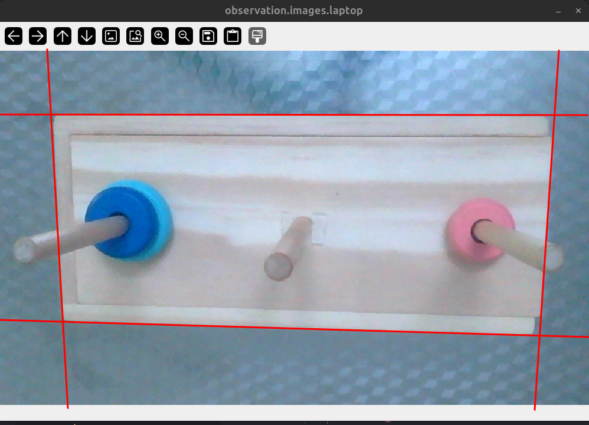
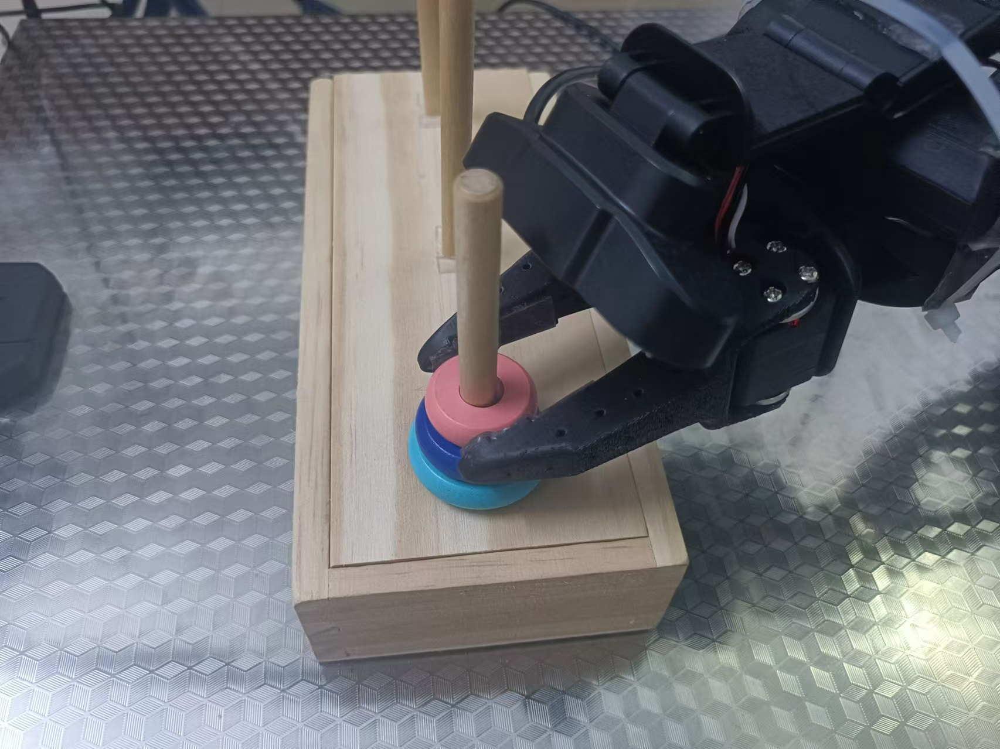
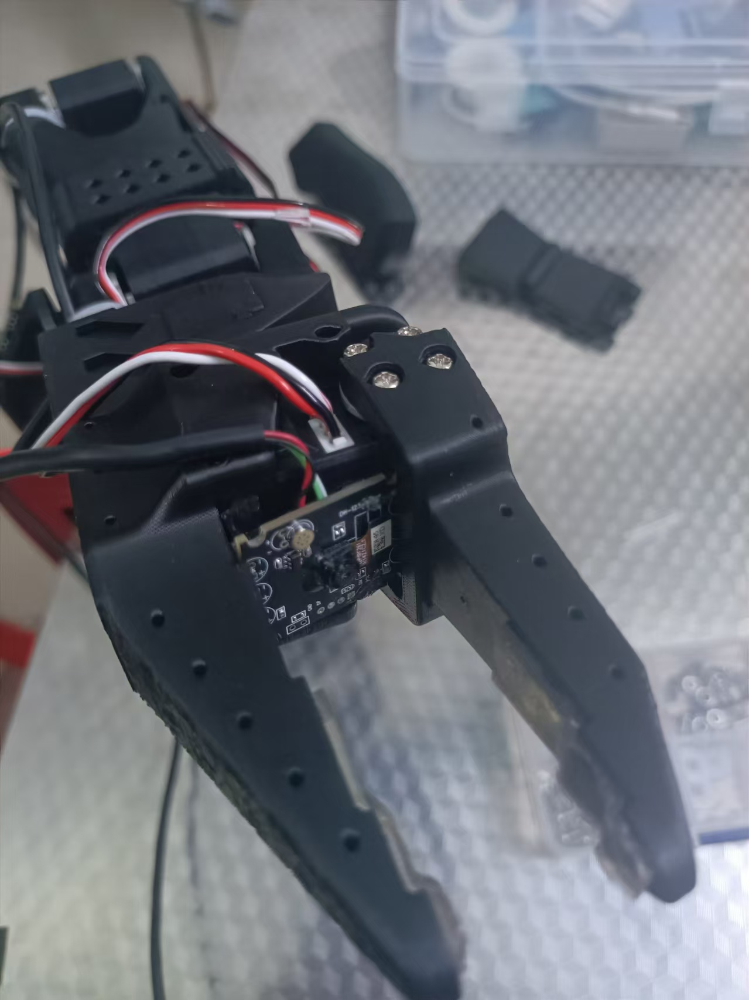
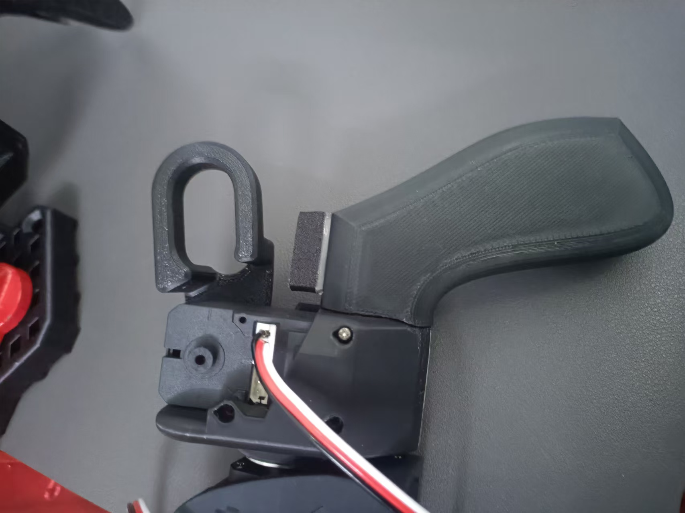
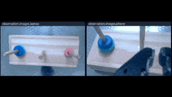

# 各相机位置

## 1. 初始相机位置

分辨率 640*480 帧率30hz

顶部摄像头得拉高才能看到全景



失误表现

1. 有时夹低处的中间的蓝色圆盘，不是顶部的粉色圆盘
2. 夹起来后，不能放入右边第三个柱子，洞口对不齐


## 2. 调整顶部相机

顶部摄像头拉下来一些

更大的分辨率（800*480）但帧率被动限制到 15hz

相机位置细节




## 3. 调整腕部相机

初始相机位置：



由于该拍摄角度，模型无法准确分清重叠盘的正确位置，如：抓取顶部粉色圆盘，会误抓第二层深蓝色圆盘

因此调整腕部摄像机的位置，放入前爪中心：



为防止从臂前爪完全闭合损坏相机电路，主臂设置限制块：



# 3盘汉诺塔训练结果 （仅调整顶部相机）

## 1. Move smallest disk from A to C 

```
TASK_NAME=MovA2C_3
```

model1：完成任务回到初始位置（弃用）


model2：完成任务停到中间（更好衔接下一个动作）

训练 `5w` 次，`30 episode`，

成功率： `6/10`，

失误表现：

	1. 无法精细分清粉、蓝盘，有时会抓住蓝盘一起移动 （4次）


------

## 2. Move middle disk from A to B 

```
TASK_NAME=MovA2B_2
```

训练 `5w` 次，`30 episode`，

成功率： `7/10`，

失误表现：

	1. 无法精细分蓝、青盘，有时会抓住青盘一起移动 （2次）
	1. 抓住蓝盘无法放入中间柱子（1次）



------

## 3. Move smallest disk from C to B 

```
TASK_NAME=MovC2B_3
```

训练 `5w` 次，`30 episode`，

成功率： `10/10`，


------

## 4. Move biggest disk from A to C

```
TASK_NAME=MovA2C_1 
```

训练 `5w` 次，`30 episode`，

成功率： `9/10`，

失误表现：

 	1. 人经过导致光线变化，抓住青盘无法放入右边柱子（1次）


------


## 5. Move smallest disk from B to A

```
TASK_NAME=MovB2A_3 
```

训练 `5w` 次，`30 episode`，

成功率： `7/10`，

失误表现：

 	1. 无法精细分清粉、蓝盘，有时会抓住蓝盘一起移动 （1次）
 	2. 桌子歪着摆（光线变化）情况 1 的失误会变多（2次）


------


## 6. Move middle disk from B to C

```
TASK_NAME=MovB2C_2 
```

训练 `5w` 次，`30 episode`，

成功率： `10/10`，

采集数据集时，多改变环境（摆动桌子的位置），训练出来的模型也更泛用


------


## 7. Move smallest disk from A to C

```
TASK_NAME=MovA2C_3
```

训练 `5w` 次，`30 episode`，

成功率： `10/10`，


# 4盘汉诺塔训练结果（各相机调整完成）

按状态、动作区分的模型 （3个柱子，3个盘要7个模型， 4个盘要15个模型）

模型路径：

```
outputs/train/A[1234]-B[]-C[]_mvA2B/last/pretrained_model
outputs/train/A[123]-B[4]-C[]_mvA2C/last/pretrained_model
outputs/train/A[12]-B[4]-C[3]_mvB2C/last/pretrained_model
outputs/train/A[12]-B[]-C[34]_mvA2B/last/pretrained_model
outputs/train/A[1]-B[2]-C[34]_mvC2A/last/pretrained_model
outputs/train/A[14]-B[2]-C[3]_mvC2B/last/pretrained_model
outputs/train/A[14]-B[23]-C[]_mvA2B/last/pretrained_model
outputs/train/A[1]-B[234]-C[]_mvA2C/last/pretrained_model
outputs/train/A[]-B[234]-C[1]_mvB2C/last/pretrained_model
outputs/train/A[]-B[23]-C[14]_mvB2A/last/pretrained_model
outputs/train/A[3]-B[2]-C[14]_mvC2A/last/pretrained_model
outputs/train/A[34]-B[2]-C[1]_mvB2C/last/pretrained_model
outputs/train/A[34]-B[]-C[12]_mvA2B/last/pretrained_model
outputs/train/A[3]-B[4]-C[12]_mvA2C/last/pretrained_model
outputs/train/A[]-B[4]-C[123]_mvB2C/last/pretrained_model
```

仅按动作区分的模型（ 3个柱子，共有 $2*C_3^2=6$ 总移动的可能，固可考虑整合训练6个模型 ）

模型名称：

```
# mvA2B  每状况 10 episodes
A[1234]-B[]-C[]_mvA2B
A[12]-B[]-C[34]_mvA2B
A[14]-B[23]-C[]_mvA2B
A[34]-B[]-C[12]_mvA2B

# mvA2C 每状况 13～14 episodes
A[123]-B[4]-C[]_mvA2C
A[1]-B[234]-C[]_mvA2C
A[3]-B[4]-C[12]_mvA2C

# mvB2C 每状况 10 episodes
A[12]-B[4]-C[3]_mvB2C
A[]-B[234]-C[1]_mvB2C
A[34]-B[2]-C[1]_mvB2C
A[]-B[4]-C[123]_mvB2C

# mvB2A 40 episodes
A[]-B[23]-C[14]_mvB2A

# mvC2A 每状况 20 episodes
A[1]-B[2]-C[34]_mvC2A
A[3]-B[2]-C[14]_mvC2A

# mvC2B 40 episodes
A[14]-B[2]-C[3]_mvC2B
```


## 采集数据

```
----40 episodes camera middle(20)、up(10)、down(10)

TASK_NAME=A1234-B-C_mvA2B  ok
TASK_NAME=A123-B4-C_mvA2C  ok
TASK_NAME=A12-B4-C3_mvB2C  ok
TASK_NAME=A12-B-C34_mvA2B  ok
TASK_NAME=A1-B2-C34_mvC2A  ok
TASK_NAME=A14-B2-C3_mvC2B  ok
TASK_NAME=A14-B23-C_mvA2B  ok
TASK_NAME=A1-B234-C_mvA2C  ok
TASK_NAME=A-B234-C1_mvB2C  ok
TASK_NAME=A-B23-C14_mvB2A  ok
TASK_NAME=A3-B2-C14_mvC2A  ok

----20 episodes camera middle(20) only
TASK_NAME=A34-B2-C1_mvB2C  ok
TASK_NAME=A34-B-C12_mvA2B  half downloaded (retrained)
TASK_NAME=A3-B4-C12_mvA2C  ok
TASK_NAME=A-B4-C123_mvB2C  half download

HF_USER=ricaal
```


```
----30 episodes camera fixed

TASK_NAME=A1234-B-C_mvA2B  ok
TASK_NAME=A123-B4-C_mvA2C  
TASK_NAME=A12-B4-C3_mvB2C  
TASK_NAME=A12-B-C34_mvA2B  
TASK_NAME=A1-B2-C34_mvC2A  
TASK_NAME=A14-B2-C3_mvC2B  
TASK_NAME=A14-B23-C_mvA2B  
TASK_NAME=A1-B234-C_mvA2C  
TASK_NAME=A-B234-C1_mvB2C  
TASK_NAME=A-B23-C14_mvB2A  
TASK_NAME=A3-B2-C14_mvC2A  
TASK_NAME=A34-B2-C1_mvB2C  
TASK_NAME=A34-B-C12_mvA2B  
TASK_NAME=A3-B4-C12_mvA2C  
TASK_NAME=A-B4-C123_mvB2C  

HF_USER=ricaal
```


```
python lerobot/scripts/control_robot.py record \
    --robot-path lerobot/configs/robot/so100.yaml \
    --fps 15 \
    --repo-id ${HF_USER}/${TASK_NAME} \
    --tags so100 tutorial \
    --warmup-time-s 20 \
    --episode-time-s 40 \
    --reset-time-s 0 \
    --num-episodes 30 \
    --push-to-hub 0 \
    --single-task "4 disk hanoi solution"
```

恢复录制 （num-episodes 则为新增的录制集数）

```
--resume 1 \
```

可视化

```
python lerobot/scripts/visualize_dataset_html.py \
  --repo-id ${HF_USER}/${TASK_NAME} \
  --root ~/.cache/huggingface/lerobot/${HF_USER}/${TASK_NAME} \
  --local-files-only 1
```

## 训练数据

```
python lerobot/scripts/train_offline.py \
  dataset_repo_id=${HF_USER}/${TASK_NAME} \
  policy=act_so100_real \
  env=so100_real \
  hydra.run.dir=outputs/train/${TASK_NAME} \
  hydra.job.name=${TASK_NAME} \
  device=cuda \
  wandb.enable=true
```

## 测试结果

```
python lerobot/scripts/control_robot.py record \
  --robot-path lerobot/configs/robot/so100.yaml \
  --fps 15 \
  --repo-id ${HF_USER}/eval_${TASK_NAME} \
  --tags so100 tutorial eval \
  --warmup-time-s 5 \
  --episode-time-s 200 \
  --reset-time-s 5 \
  --num-episodes 1 \
  --push-to-hub 0 \
  --single-task "eval: 4 disk hanoi solution" \
  -p outputs/train/${TASK_NAME}/checkpoints/last/pretrained_model
```

```
python lerobot/scripts/visualize_dataset_html.py \
  --repo-id ${HF_USER}/eval_${TASK_NAME} \
  --root ~/.cache/huggingface/lerobot/${HF_USER}/eval_${TASK_NAME} \
  --local-files-only 1
```


```
python lerobot/scripts/control_robot.py record \
  --robot-path lerobot/configs/robot/so100.yaml \
  --fps 15 \
  --repo-id ${HF_USER}/eval_test \
  --tags so100 tutorial eval \
  --warmup-time-s 0 \
  --episode-time-s 200 \
  --reset-time-s 2 \
  --num-episodes 1 \
  --push-to-hub 0 \
  --single-task "eval: 4 disk hanoi solution" \
  -p outputs/train/${TASK_NAME}/checkpoints/last/pretrained_model
```

```
python lerobot/scripts/visualize_dataset_html.py \
  --repo-id ${HF_USER}/eval_${TASK_NAME} \
  --root ~/.cache/huggingface/lerobot/${HF_USER}/autoHanoi_1 \
  --local-files-only 1
```

light

```
0  3  4  9 10  12
```

no light

``` 
0 1 2 4 7 8 
```

light2

```
0 1 
```

