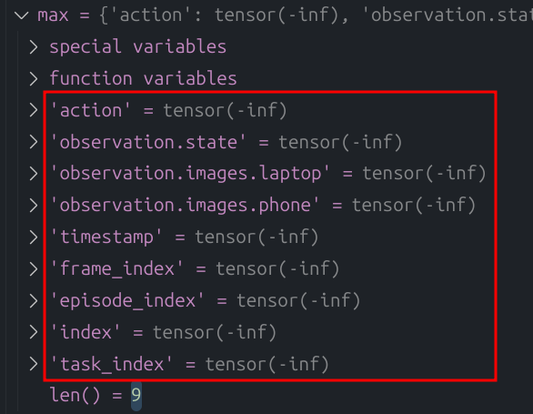

## 1. 删除制定序号的episode

函数位于： [DataSetUtils.py](../test/DataSetUtils.py) 

调用例子（函数调用）：删除 test 数据集的 38号 episode的数据

```
 base_path = "/home/rical/.cache/huggingface/lerobot/test"
 delete_episode(base_path, 38)
```

## 2. 合并两个数据集

函数位于： [DataSetUtils.py](../test/DataSetUtils.py) 

调用例子（函数调用）：将数据集 test1、 test2 合并成 test3 （ test2 的数据加到 test1 的末尾 ）

```
 dataset1 = "/home/rical/.cache/huggingface/lerobot/test1"
 dataset2 = "/home/rical/.cache/huggingface/lerobot/test2"
 output = "/home/rical/.cache/huggingface/lerobot/test3"
 
 merge_datasets(dataset1, dataset2, output)
```

## 3. 重新计算统计量

函数位于： [ReConsolidate.py](../test/ReConsolidate.py) 

调用例子（文件调用）：将 repo_id 对应的数据集，重新计算 mean、max、min、std，待计算的变量：



```
python test/ReConsolidate.py --dataset_repo_id ${HF_USER}/${TASK_NAME}
```

